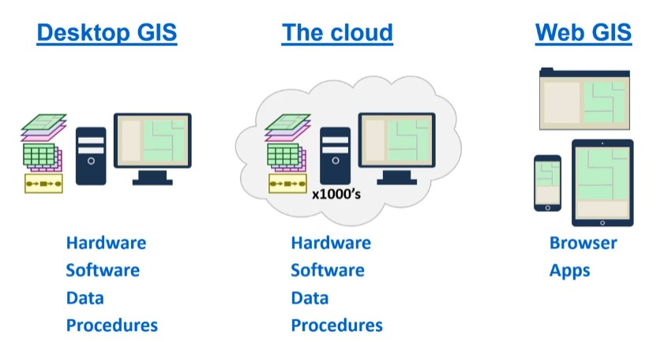

## What is GIS
geographic information system：地理信息系统(这不是一个专有名词，因此在句子中它不会被大写)
GIS：地理信息系统的缩写，因此大写。
### Defining GIS
Geographic information system is a computer system for
+ capturing
+ storing
+ filtering
+ analyzing
+ visualizing
==geospatial== data.
这是从GIS的功能方面进行定义。

Components of a GIS
+ Hardware
+ Software
+ Geospatial data
+ Procedures (data management and analysis)
+ People
这是从GIS的组成上分析。
现在GIS的定义逐渐拓宽更新，我们还有==云GIS==以及==浏览器GIS==，如下图所示：

### Software
ArcGIS Desktop
+ ArcMap: 创造和分析地图
+ ArcCatalog: 文件管理
+ ArcScene：3D可视化