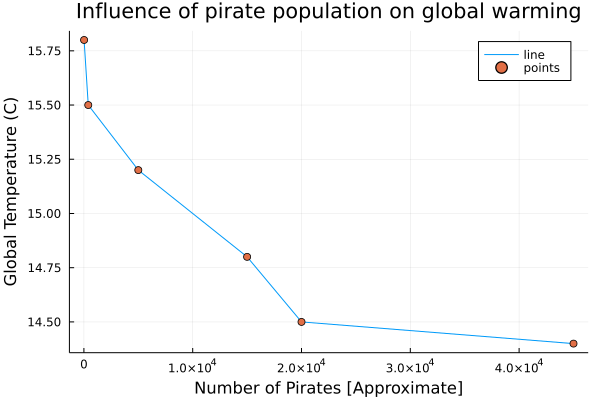
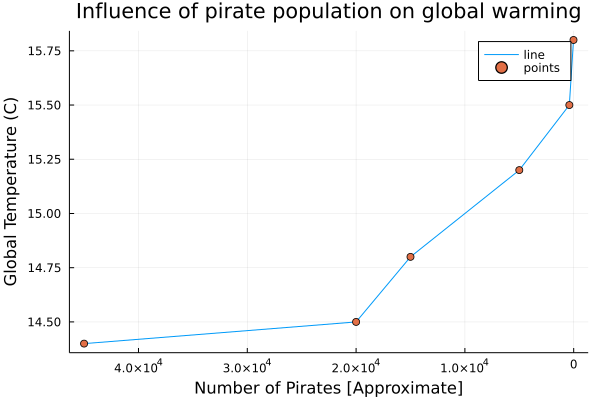
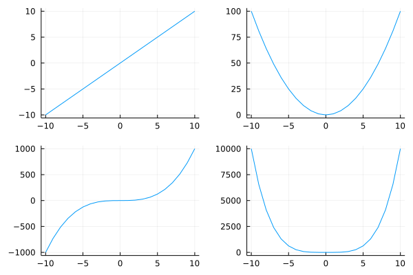

### Getting started
两个函数：
+ `convert(T, x)`：其中$x$必须为数字，`T`为数据类型。
+ `parse(T, str, base)`：将字符串转换为数字，其中`base`指的是转换为几进制。

### String
在`julia`中字符串可以用双引号(`"str"`)或三个双引号`"""str"""`表示，不同的是，后者的三引号中可以包含引号，像这样：
~~~julia
"""Look, Mom, no "errors"!!! """
~~~

与Python中不同，Julia中单引号`''`表示字符(Char)。
我们可以使用`$`符号将现有的变量插入到字符串中，并在字符串中计算表达式的值：
~~~julia
name = "Jane"
num_fingers = 10
num_toes = 10

println("Hello, my name is $name.")
println("I have $num_fingers fingers and $num_toes toes.")
println("That is $(num_fingers + num_toes) digits in all!!")
~~~
#### String concatenation
第一种方法是使用`string()`函数：
~~~julia
s3 = "How many cats ";
s4 = "is too many cats?";
😺 = 10

string(s3, s4)

> "How many cats is too many cats?"

string("I don't know, but ", 😺, " is too few.")

> "I don't know, but 10 is too few."
~~~
也可以用`*`符号进行拼接：
~~~julia
s3*s4

> "How many cats is too many cats?"
~~~


> 函数`repeat(x, inner=, outer=)`
> 重复数字或字符串，其中inier参数指的是内部重复多少遍，outer指的是外部(整个对象)重复多少遍，inner和outer可以为元组，表示在行方向和列方向的重复。

### Data Struct
#### Tuples
我们可以用`()`来创建元组：
~~~julia
myfavoriteanimals = ("penguins", "cats", "sugargliders")

myfavoriteanimals[1]
> "penguins"
~~~
元组为不可变类型，一旦我们创建就不能改变其内容，如`myfavoriteanimals[1] = "otters"`就会出错。
#### NamedTuples
在`Julia 1.6`中我们可以定义NamedTuples了：
~~~julia
myfavoriteanimals = (bird = "penguins", mammal = "cats", marsupial = "sugargliders")

myfavoriteanimals[1]
> "penguins"

myfavoriteanimals.bird
> "penguins"
~~~
#### Dictionaries
定义方法：
```julia
Dict(key1 => value1, key2 => value2, ...)
```
例
~~~julia
myphonebook = Dict("Jenny" => "867-5309", "Ghostbusters" => "555-2368")
myphonebook["Jenny"]
# 我们可以通过键值对向里面添加元素
myphonebook["Kramer"] = "555-FILK"
# 可以通过函数删除元素
pop!(myphonebook, "Kramer")
# 由于字典是无序的，我们不能用数字索引它们，如下列命令会出错
myphonebook[1]
~~~

> 在初始化字典的时候有一个问题需要注意：字典在初始化的时候会对数据类型进行推断，比如你在创建的过程中value中类型有int和string，那么下次添加元素时，value的类型可以是int或string，但是如果在创建的过程中value的类型只有int，那么在通过键值对添加元素时value的类型为string就会出错。
#### Arrays
类似于Python中的列表，但是Array中能存放不同的数据类型：
~~~julia
mixture = [1, 1, 2, 3, "Ted", "Robyn"]
# 我们可以对其机型索引
myfriends[3]
# 也可以通过索引进行修改
myfriends[3] = "Baby Bop"
# push!函数在Array最后一个位置添加元素，pop!从最后一个位置删除元素
# 也可以定义多维Array
favorites = [["koobideh", "chocolate", "eggs"],["penguins", "cats", "sugargliders"]]

numbers = [[1, 2, 3], [4, 5], [6, 7, 8, 9]]

# Array采用地址传递，如果不想改变原Array可以使用copy函数
~~~
### Loops
#### while
~~~julia
myfriends = ["Ted", "Robyn", "Barney", "Lily", "Marshall"]

i = 1
while i <= length(myfriends)
    friend = myfriends[i]
    println("Hi $friend, it's great to see you!")
    i += 1
end
~~~
#### for
~~~julia
m, n = 5, 5
A = fill(0, (m, n))


5×5 Matrix{Int64}:
 0  0  0  0  0
 0  0  0  0  0
 0  0  0  0  0
 0  0  0  0  0
 0  0  0  0  0


for j in 1:n
    for i in 1:m
        A[i, j] = i + j
    end
end
A

5×5 Matrix{Int64}:
 2  3  4  5   6
 3  4  5  6   7
 4  5  6  7   8
 5  6  7  8   9
 6  7  8  9  10
~~~
另一种方法：
~~~julia
B = fill(0, (m, n))
for j in 1:n, i in 1:m
    B[i, j] = i + j
end
B

5×5 Matrix{Int64}:
 2  3  4  5   6
 3  4  5  6   7
 4  5  6  7   8
 5  6  7  8   9
 6  7  8  9  10
~~~
类似于Python中列表表达式：
~~~julia
C = [i + j for i in 1:m, j in 1:n]

5×5 Matrix{Int64}:
 2  3  4  5   6
 3  4  5  6   7
 4  5  6  7   8
 5  6  7  8   9
 6  7  8  9  10
~~~
### Conditionals
~~~julia
N = 5

if (N % 3 == 0) && (N % 5 == 0) # `&&` means "AND"; % computes the remainder after division
    println("FizzBuzz")
elseif N % 3 == 0
    println("Fizz")
elseif N % 5 == 0
    println("Buzz")
else
    println(N)
end
~~~
三元运算符
~~~julia
x = 10
y = 30

(x > y) ? x : y
~~~
短路运算符`&&`和`||`：
~~~julia
# 第一个为false，后面运行不运行都是false，所以后面一句不运行
false && (println("hi"); true)

> false

true && (println("hi"); true)

> hi

# 与之对应的

true || println("hi")

> true

false || println("hi")

> hi
~~~
### Functions
#### How to declare a function
`Julia`定义函数的方法有很多种：
第一种需要用到`function`和`end`关键字：
~~~julia
function sayhi(name)
    println("Hi $name, it's great to see you!")
end

function f(x)
    x^2
end
~~~
另外，我们也可以用一行定义函数:
~~~julia
sayhi2(name) = println("Hi $name, it's great to see you!")

f2(x) = x^2
~~~
也可以通过匿名函数
~~~julia
sayhi3 = name -> println("Hi $name, it's great to see you!")

f3 = x -> x^2
~~~
#### Duck-typing
所谓Duck-typing指的是：它只关心事物的外部行为而非内部结构。
~~~julia
sayhi(55595472)
> Hi 55595472, it's great to see you!

A = rand(3, 3)
A

3×3 Matrix{Float64}:
 0.266695  0.631405  0.22408
 0.595354  0.631511  0.610945
 0.576297  0.629493  0.574692

f(A)
3×3 Matrix{Float64}:
 0.576172  0.708189  0.574292
 0.886836  1.1593    0.870331
 0.85966   1.12317   0.843993

f("hi")
> "hihi"
~~~
#### Mutating vs. non-mutating functions
带有`!`的函数一般会改变函数的值：
~~~julia
v = [3, 5, 2]
sort(v)
# 这样并不会改变v的值，相反下列会改变v的值
sort!(v)
~~~
#### Some higher order functions
map函数在`Julia`中是一个高阶函数，将函数应用到传递给它的数据结构的每个元素。
~~~julia
map(f, [1, 2, 3])
map(x -> x^3, [1, 2, 3])
~~~
broadcast是另一个类似于map的高阶函数，broadcast是map函数的推广，所以它能做比map函数多的事情。语法与map相同：
~~~julia
broadcast(f, [1, 2, 3])
# 等价于
f.([1, 2, 3]) # 对每个元素进行操作
~~~
### Plotting
~~~julia
using Plots
~~~
下面我们生成数据：
~~~julia
globaltemperatures = [14.4, 14.5, 14.8, 15.2, 15.5, 15.8];
numpirates = [45000, 20000, 15000, 5000, 400, 17];
~~~
`Plots`支持多个后端，我们使用`gr`后端：
~~~julia
gr()
> Plots.GRBackend()
~~~
现在我们可以绘图了：
~~~julia
plot(numpirates, globaltemperatures, label="line")
# scatter函数后面加!表示scatter!函数为变异函数，可以将散点图加到上面的图中，后面的xlabel!等# # 用法相同
scatter!(numpirates, globaltemperatures, label="points")
xlabel!("Number of Pirates [Approximate]")
ylabel!("Global Temperature (C)")
title!("Influence of pirate population on global warming")
~~~

> 很漂亮有没有
我们可以改变$x$的方向：
~~~julia
xflip!()
~~~

不改变语法，我们可以使用UnicodePlots后端：
~~~julia
unicodeplots()

plot(numpirates, globaltemperatures, label="line")  
scatter!(numpirates, globaltemperatures, label="points") 
xlabel!("Number of Pirates [Approximate]")
ylabel!("Global Temperature (C)")
title!("Influence of pirate population on global warming")


                          Influence of pirate population on global warming       
                          +----------------------------------------+       
                   15.842 | ⚬                                      | line  
                          | |                                      | points
                          | \                                      |       
                          | ⚬                                      |       
                          | |*.                                    |       
                          | | \.                                   |       
                          | |  "⚬.                                 |       
   Global Temperature (C) | |    "*.                               |       
                          | |      "*.                             |       
                          | |        "*.                           |       
                          | |          "⚬.                         |       
                          | |            \.                        |       
                          | |             ".                       |       
                          | |               ⚬--_______             |       
                   14.358 | |                         """"""\----⚬ |       
                          +----------------------------------------+       
                           -1332.49Number of Pirates [Approximate]46349.5
~~~
绘制多个子图：
~~~julia
gr()
x = -10:10;
y = [i^2 for i in x];

p1 = plot(x, x)
p2 = plot(x, x.^2)
p3 = plot(x, x.^3)
p4 = plot(x, x.^4)
plot(p1, p2, p3, p4, layout = (2, 2), legend = false)
~~~

### Multiple dispatch
多重分派是Julia非常重要的特性。
在Julia中，我们可以不提供任何输入的信息来定义函数：
~~~julia
f(x) = x.^2
f(10)
> 100
f([1, 2, 3])
> 3-element Vector{Int64}: …
~~~
Julia将自行决定哪些输入参数类型有意义，哪些没有意义。
我们也可以给定输入的类型：
~~~julia
foo(x::String, y::String) = println("My inputs x and y are both strings!")
# 这样的话输入就只能为String类型
foo("hello", "hi!")
> My inputs x and y are both strings!
foo(3, 4) # 出错，但是如果我们添加方法：
foo(x::Int, y::Int) = println("My inputs x and y are both integers!")
foo(3, 4)
> My inputs x and y are both integers!
~~~
在这里`foo`为泛型函数，`foo(x::Int, y::Int) = println("My inputs x and y are both integers!")`并没有重写`foo(x::String, y::String) = println("My inputs x and y are both strings!")`，而是给泛型函数`foo`添加了一个新的方法。
~~~julia
# 利用@which可以看到我们在运行函数是使用的方法
@which foo(3, 4)
> foo(x::**Int64**, y::**Int64**) in Main at In[12]:1
~~~
我们可以继续添加方法，可以添加抽象类型`Number`
~~~julia
foo(x::Number, y::Number) = println("My inputs x and y are both numbers!")
~~~
也可以添加鸭子类型的方法：
~~~julia
foo(x, y) = println("I accept inputs of any type!")
~~~
