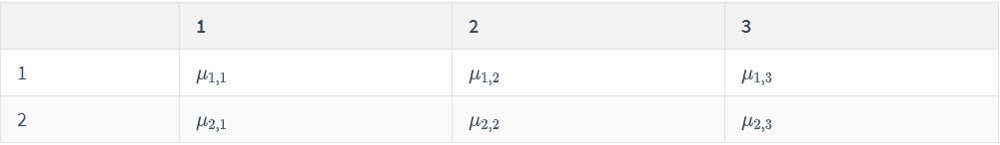

### 线性回归

我们的线性回归模型为：
$$
y_i = \beta_0 + \beta_1x_{1i} + \cdots + \beta_kx_{ki}+\epsilon_i,\quad \epsilon_i \stackrel{\text{idd}}{\sim}\mathcal{N}(0,\sigma^2)
$$
所以
$$
y_i\mid x_i,\beta,\sigma^2\stackrel{\text{iid}}{\sim}\mathcal{N}(\beta_0+\beta_1x_{1i}+\cdots+\beta_kx_{ki},\sigma^2)
$$

~~~R
library("car")
data("Leinhardt")

loginfat <- log(Leinhardt$infant)
logincome <- log(Leinhardt$income)

lmod <- lm(loginfat ~ logincome)
summary(lmod)

> Call:
lm(formula = loginfat ~ logincome)

Residuals:
     Min       1Q   Median       3Q      Max 
-1.66694 -0.42779 -0.02649  0.30441  3.08415 

Coefficients:
            Estimate Std. Error t value Pr(>|t|)    
(Intercept)  7.14582    0.31654  22.575   <2e-16 ***
logincome   -0.51179    0.05122  -9.992   <2e-16 ***
---
Signif. codes:  0 ‘***’ 0.001 ‘**’ 0.01 ‘*’ 0.05 ‘.’ 0.1 ‘ ’ 1

Residual standard error: 0.6867 on 99 degrees of freedom
  (因为不存在，4个观察量被删除了)
Multiple R-squared:  0.5021,	Adjusted R-squared:  0.4971 
F-statistic: 99.84 on 1 and 99 DF,  p-value: < 2.2e-16

~~~

#### 使用JAGS

~~~R
library("rjags")

logincome <- logincome[!is.na(loginfat)]
loginfat <- loginfat[!is.na(loginfat)]

mod1_string <- "model {
  for (i in 1:n) {
    y[i] ~ dnorm(mu[i], prec)
    mu[i] = b[1] + b[2]*logincome[i]
  }
  
  for (j in 1:2) {
    b[j] ~ dnorm(0.0, 1.0/1.0e6)
  }
  
  prec ~ dgamma(5.0/2.0, 5.0*10.0/2.0)
  sig2 = 1.0 / prec
  sig = sqrt(sig2)
}"

set.seed(72)
data1_jags <- list(y=loginfat, n=length(loginfat), logincome=logincome)

params1 <- c("b", "sig")

inits1 <- function() {
  inits <- list("b"=rnorm(2, 0.0, 100.0), "prec"=rgamma(1,1.0,1.0))
}

mod1 <- jags.model(textConnection(mod1_string),data=data1_jags, inits=inits1,n.chains=3)

update(mod1, 1000)
mod1_sim <- coda.samples(model = mod1, variable.names = params1, n.iter = 5e3)
mod1_csim <- do.call(rbind, mod1_sim)
~~~

#### Model checking

~~~R
plot(mod1_sim)
~~~

~~~R
gelman.diag(mod1_sim)

Potential scale reduction factors:

     Point est. Upper C.I.
b[1]          1       1.01
b[2]          1       1.01
sig           1       1.00

Multivariate psrf

1
~~~

可以看到结果非常接近于$1$，所以我们的链还是很好的。

~~~R
> autocorr.diag(mod1_sim)
             b[1]       b[2]          sig
Lag 0  1.00000000 1.00000000  1.000000000
Lag 1  0.95197200 0.95282871  0.015451819
Lag 5  0.78225051 0.78330860  0.010686958
Lag 10 0.60395025 0.60607845 -0.010001226
Lag 50 0.03514703 0.03484911 -0.008307661
~~~

可以看到相关系数很大，说明我们的链包含的信息有限，我们来看一下我们的链的有效样本数：

~~~R
> effectiveSize(mod1_sim)
      b[1]       b[2]        sig 
  367.5992   362.2606 14485.3256 
~~~

可以看到我们b[1]和b[2]的有效样本数都很小。

~~~R
> summary(mod1_sim)

Iterations = 1001:6000
Thinning interval = 1 
Number of chains = 3 
Sample size per chain = 5000 

1. Empirical mean and standard deviation for each variable,
   plus standard error of the mean:

        Mean      SD  Naive SE Time-series SE
b[1]  7.1488 0.44742 0.0036531      0.0232760
b[2] -0.5123 0.07240 0.0005912      0.0037932
sig   0.9714 0.06802 0.0005554      0.0005656

2. Quantiles for each variable:

        2.5%     25%     50%     75%   97.5%
b[1]  6.2877  6.8408  7.1428  7.4548  8.0374
b[2] -0.6559 -0.5612 -0.5116 -0.4625 -0.3718
sig   0.8480  0.9239  0.9678  1.0150  1.1153
~~~

可以看到我们的结果与直接用`lm`函数跑出来的结果还是有一定的差异的。可以看到我们估计的方差比直接用`lm`估计得到的方差$0.6867$要大，这是因为我们的先验分布选的方差为$(5.0*10.0/2.0)/(5.0/2.0)=10$。

下面我们对残差进行检验：

残差检验非常重要，如下如果我们不进行对数转换就进行回归，我们会得到：

~~~R
lmod0 <- lm(infant~income, data = Leinhardt)
plot(resid(lmod0))
~~~

可以看到随着索引的增大，残差逐渐增大，而不是随机均匀分布的，所以模型有问题。

我们再看其预测值与残差的关系：

~~~R
plot(predict(lmod0), resid(lmod0))
~~~

可以看到残差的大小与预测值有关。

下面我们绘制qq图来检验残差的正态性：

~~~R
qqnorm(resid(lmod0))
~~~

我们知道当数据符合正态分布时，其qq图应该是近似一条直线，这个显然不符合。

下面我们检验一下我们贝叶斯回归的结果：

~~~R
X <- cbind(rep(1.0, length(logincome)), logincome)
pm_params1 <- colMeans(mod1_csim)

yhat1 <- drop(X%*% pm_params1[1:2])
resid1 <- data1_jags$y - yhat1
plot(yhat1, resid1)
~~~

可以看出残差与预测值基本没有关系。

~~~R
qqnorm(resid1)
~~~

可以看到有两个异常点的残差很大

#### Alternative models

那两个异常点我们没有很好的解释，可能是因为还存在其他变量可以解释。我们新构建一个模型：

~~~R
mod2_string <- " model {
  for (i in 1:length(y)) {
    y[i] ~ dnorm(mu[i], prec)
    mu[i] = b[1] + b[2]*log_income[i] + b[3]*is_oil[i]
  }
  for (i in 1:3) {
    b[i] ~ dnorm(0.0, 1.0/1.0e6)
  }
  prec ~ dgamma(5.0/2.0, 5.0*10.0/2.0)
  sig = 1.0 / prec
}
"

data2_jags <- list(y=loginfat, log_income=logincome, is_oil=is_oil)

params2 <- c("b", "sig")

init2 <- function() {
  inits <- list('b'=rnorm(3, 0.0, 100.0), 'prec'=rgamma(1, 1.0, 1.0))
}

mod2 <- jags.model(textConnection(mod2_string), data = data2_jags, inits = init2, n.chains = 3)
update(mod2, 1e3)

mod2_sim <- coda.samples(model = mod2, variable.names = params2, n.iter = 5e3)

mod2_csim <- as.mcmc(do.call(rbind, mod2_sim))
summary(mod2_csim)

X2 <- cbind(rep(1.0, length(logincome)), data2_jags$log_income, data2_jags$is_oil)
pm_params <- colMeans(mod2_csim)
yhat2 <- drop(X2 %*% pm_params[1:3])
resid2 <- data2_jags$y - yhat2
par(mfrow=c(2,1))
plot(yhat2, resid2)
plot(yhat1, resid1)
~~~

> 预测值与残差的关系图：可以看到我们的模型有了改善，至少异常值离均值的距离变近了。

虽然模型得到了改善，但是我们还是存在异常值，我们可以通过改变似然函数来提升模型。

那么我们的模型变为：

~~~R
mod3_string <- "model {
  for (i in 1:length(y)) {
    y[i] ~ dt(mu[i], tau, df)
    mu[i] = b[1] + b[2] * log_income[i] + b[3] * is_oil[i]
  }
  for (i in 1:3) {
    b[i] ~ dnorm(0.0, 1.0/1.0e6)
  }
  df = nu + 2.0
  nu ~ dexp(1.0)
  
  tau ~ dgamma(5.0/2.0, 5.0*10.0/2.0)
  sig = sqrt(1.0 / tau * df /(df-2))
}
"

data3_jags <- list(y = loginfat, log_income = logincome, is_oil=is_oil)
params3 <- c("b", "sig")
init3 <- function() {
  inits <- list('b' = rnorm(3, 0.0, 100.0), 'nu' = rexp(1.0), 'tau'=rgamma(1, 1.0, 1.0))
}
mod3 <- jags.model(textConnection(mod3_string), data = data3_jags, inits = init3, n.chains = 3)
update(mod3, 1000)
mod3_sim <- coda.samples(model = mod2, variable.names = params3,n.iter = 5e3)
mod3_csim <- as.mcmc(do.call(rbind,mod3_sim))
summary(mod3_csim)

Iterations = 1:15000
Thinning interval = 1 
Number of chains = 1 
Sample size per chain = 15000 

1. Empirical mean and standard deviation for each variable,
   plus standard error of the mean:

        Mean      SD  Naive SE Time-series SE
b[1]  7.1894 0.44017 0.0035939       0.023270
b[2] -0.5292 0.07145 0.0005833       0.003756
b[3]  0.7929 0.35153 0.0028702       0.003155
sig   0.9125 0.13124 0.0010715       0.001101

2. Quantiles for each variable:

         2.5%     25%     50%     75%   97.5%
b[1]  6.32841  6.8890  7.1861  7.4836  8.0730
b[2] -0.67229 -0.5771 -0.5296 -0.4802 -0.3898
b[3]  0.09761  0.5577  0.7926  1.0235  1.4915
sig   0.69260  0.8189  0.9005  0.9918  1.2038
~~~

~~~R
X3 <- cbind(rep(1.0, length(logincome)), data2_jags$log_income, data2_jags$is_oil)
pm_params <- colMeans(mod3_csim)
yhat3 <- drop(X3 %*% pm_params[1:3])
resid3 <- data3_jags$y - yhat3
par(mfrow=c(2,1))
plot(yhat2, resid2)
plot(yhat1, resid3)
~~~

> 可以看出残差的分布更为紧凑了。

#### Deviance information criterion

我们可以使用dic来衡量模型的好坏：

~~~R
> dic.samples(mod1, n.iter = 5e3)
  |**************************************************| 100%
Mean deviance:  231.5 
penalty 3.036 
Penalized deviance: 234.5 
> dic.samples(mod2, n.iter = 5e3)
  |**************************************************| 100%
Mean deviance:  225.3 
penalty 4.032 
Penalized deviance: 229.3 
> dic.samples(mod3, n.iter = 5e3)
  |**************************************************| 100%
Mean deviance:  231.2 
penalty 3.935 
Penalized deviance: 235.1 
~~~

Mean deviance表示的后验分布平均偏差，等于$-2$乘以对数似然，因此值越小表示似然越大。penalty与模型复杂度有关，Penalized deviance衡量模型的好坏，是前两者的和，越小表示模型越好。

### ANOVA

#### Introduction

方差分析主要用于类别变量的分析上，即我们可以根据类别变量进行分组，我们的模型为：
$$
y_i|g_i,\mu,\sigma^2\stackrel{\text{iid}}{\sim}\mathcal{N}(\mu_{g_i},\sigma^2)
$$
其中$g_i\in \{1,\cdots,G\}$为所属的类别。$\mu$表示每一个组的均值，我们理解是一个向量。

我们将其写为线性回归的形式，即
$$
\mathrm{E}(y_i) = \beta_0 + \beta_1x_{1i}+\cdots +\beta_{G-1,i}
$$
其中$x_{1i}$为指示变量，当类别为$1$时其值为$1$，其余为$0$，当类别为$G$时其均值为$\beta_0$。

假设我们有两个类别变量，如下表所示：

假设两个类别变量是没有交互的，在上面的那个例子就是说当变量A($3$个类的那个)在level 1时变量B从level 1变为level 2的差别与A在level 2和level 3时变量B从level 1变为level 2的相同。其模型为：
$$
\mathrm{E}(y_i) = \mu + \alpha_2I_{a_i=2} + \beta_2I_{b_i=2}+\beta_3I(b_i=3)
$$

#### One way model

~~~R
data("PlantGrowth")
boxplot(weight ~ group, data = PlantGrowth)
lmod <- lm(weight ~ group, data = PlantGrowth)
~~~

~~~R
> summary(lmod)

Call:
lm(formula = weight ~ group, data = PlantGrowth)

Residuals:
    Min      1Q  Median      3Q     Max 
-1.0710 -0.4180 -0.0060  0.2627  1.3690 

Coefficients:
            Estimate Std. Error t value Pr(>|t|)    
(Intercept)   5.0320     0.1971  25.527   <2e-16 ***
grouptrt1    -0.3710     0.2788  -1.331   0.1944    
grouptrt2     0.4940     0.2788   1.772   0.0877 .  
---
Signif. codes:  0 ‘***’ 0.001 ‘**’ 0.01 ‘*’ 0.05 ‘.’ 0.1 ‘ ’ 1

Residual standard error: 0.6234 on 27 degrees of freedom
Multiple R-squared:  0.2641,	Adjusted R-squared:  0.2096 
F-statistic: 4.846 on 2 and 27 DF,  p-value: 0.01591
~~~

可以进行方差分析：

~~~R
> anova(lmod)
Analysis of Variance Table

Response: weight
          Df  Sum Sq Mean Sq F value  Pr(>F)  
group      2  3.7663  1.8832  4.8461 0.01591 *
Residuals 27 10.4921  0.3886                  
---
Signif. codes:  0 ‘***’ 0.001 ‘**’ 0.01 ‘*’ 0.05 ‘.’ 0.1 ‘ ’ 1
~~~

其中group行的Mean Sq表示组间的差异，而Residuals表示组内的，可以看出组间的差异比组内的差异要大。

下面我们用JAGS进行建模：

~~~R
mod_string <- "model {
  for (i in 1:length(y)) {
    y[i] ~ dnorm(mu[grp[i]], prec)
  }
  
  for (j in 1:3) {
    mu[j] ~ dnorm(0.0, 1.0/1.0e6)
  }
  
  prec ~ dgamma(5/2.0, 5*1.0/2.0)
  sig = sqrt( 1.0/ prec )
}
"
data_jags <- list(y = PlantGrowth$weight, grp=as.numeric(PlantGrowth$group))

params <- c("mu", "sig")

inits <- function() {
  inits <- list("mu"=rnorm(3, 0.0, 100.0), "prec"=rgamma(1, 1.0, 1.0))
}

mod <- jags.model(textConnection(mod_string), data = data_jags, inits=inits, n.chains = 3)
update(mod, 1e3)

mod_sim <- coda.samples(model = mod, variable.names = params, n.iter = 5e3)
mod_csim <- as.mcmc(do.call(rbind, mod_sim))

pm_params <- colMeans(mod_csim)
yhat <- pm_params[1:3][data_jags$grp]
resid <- data_jags$y - yhat

plot(yhat, resid)
~~~

可以看到第三类的方差比第一类要大，所以我们可以考虑用不同的方差进行建模。

